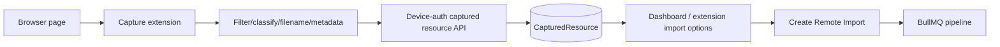

# Workflow: Browser Capture → Remote Import

## Flow

1. The user pairs the extension from Settings.
2. The extension obtains device credentials, sends heartbeats, and submits captured resources.
3. URL/request context is stored encrypted; display metadata remains safe for presentation.
4. A resource can be selected and converted into a Remote Import using shared destination/worker options.
5. After use, the resource is marked `consumed`; expired/deleted resources must not be imported again.

## Filename/Metadata Rule
The extension performs richer candidate detection, but the backend must still sanitize and validate all values before creating a Remote Import. Never trust browser metadata as authoritative security input.
