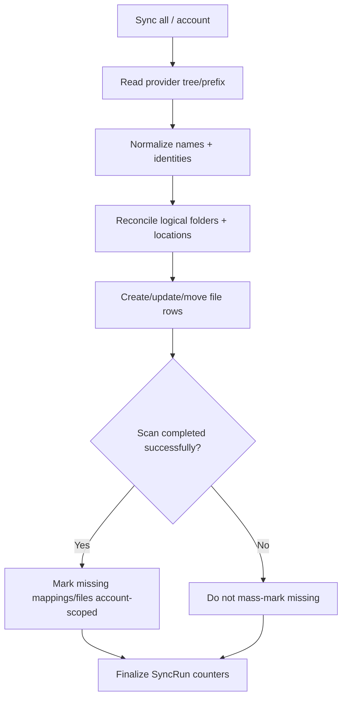

# Workflow: Provider → Virtual Sync



## Provider Rules

- Google Drive scanning uses bounded BFS/listing.
- S3 scanning is derived from object prefixes.
- Synchronization is a discovery/reconciliation process, not an upload/delete engine.

## File Page Classification

File identity is `(connectedAccountId, providerFileId)` — never filename. Each
page of discovered provider files is loaded in one `findMany` and classified
before any write (`classifyFilePage` in `backend/src/modules/sync/file-reconciler.ts`).
Every discovered file falls into exactly one category:

| Category | Condition | Write |
| --- | --- | --- |
| `new` | no row for this provider file | `create` |
| `changed` | row exists; name/size differs, or the resolved virtual parent moved | per-row `update` |
| `restored` | row exists but is soft-deleted/inactive | per-row `update` |
| `unchanged` | row identical; `lastSeenSyncRunId` ≠ current run | stamp only |
| `already_stamped` | row identical; `lastSeenSyncRunId` = current run | none |

`mimeType` is user-owned after `PATCH /files/batch/mime-type`: sync sets it on
create only and never rewrites it. `name` and `sizeBytes` stay provider-owned.
Telegram reconciliation is a separate service and does not use this module.

**Batch-safety.** `unchanged` is the only stamp-only category: those rows need
nothing but `lastSeenSyncRunId = runId` and carry no per-row payload, so their
stamping is collapsed into `updateMany` statements over the exact classified
ids. `new`, `changed` and `restored` require per-row payloads or the returned
created id and stay per-row. `already_stamped` issues no write at all, which
keeps repeated syncs within one run idempotent.

### Batched generation stamping

Unchanged rows are stamped in chunks of `STAMP_BATCH_SIZE` (500) so the
generated SQL `IN (...)` list stays bounded even though provider pages can hold
1000 entries (Drive `pageSize`, S3 `MaxKeys`). Each statement repeats the
ownership and expected-state conditions alongside the ids:

```
where: { id: { in: [...] }, userId, connectedAccountId, status: 'active',
         lastSeenSyncRunId: { not: runId } }
```

Consequences:

- A page of N unchanged files costs `ceil(N / 500)` statements instead of N.
- Cross-user and cross-account updates are impossible: the ids are already
  account-scoped by the classification query, and the `where` re-asserts
  `userId` + `connectedAccountId`.
- A row that changed between classification and the write simply fails the
  `where` and is skipped, so the batch reports a short `count`. This cannot
  cause a wrong soft-delete, because only two conditions can reject a row that
  classification already matched by id + account: the row is no longer
  `active` (missing reconciliation also filters on `status: 'active'`, so it
  ignores that row too), or it already carries this run's marker (the desired
  end state). A concurrent rename or resize does not reject the row — those
  columns are not in the `where` — so it is still stamped.
- Batches are not wrapped in an account-wide transaction. A failure throws,
  the scan aborts, the `SyncRun` is marked failed, and missing reconciliation
  never runs — so a partial stamp can never be read as "these files are gone".

Missing detection is unchanged: `reconcileMissing` still soft-deletes active
rows whose `lastSeenSyncRunId` is neither the current run nor `NULL`.

## Physical identity and the duplicate preflight

`(connectedAccountId, providerFileId)` is the *classification* identity used by
sync, but it is **NOT a uniqueness invariant** — so no unique constraint is
placed on it. The deciding counterexample is the provisional-upload
placeholder:

- Multipart, resumable, Remote Import (stream-through and temp-file) and HLS
  uploads to S3/Telegram create their `File` row **before** the provider id is
  known, with the literal `providerFileId = 'pending'`
  (`uploads/upload.routes.ts:97,116`; `remote-imports/processor.ts:299,465,505`).
  The row id is needed to build the S3 key / mute the Telegram caption id, so
  the placeholder is structurally required.
- Uploads run concurrently (up to 25 files per multipart request via
  `Promise.all`, `upload.routes.ts:179,399`), so several
  `('account', 'pending')` rows coexist on one account.
- Failure paths only soft-delete the row
  (`upload.routes.ts:108,147`; `processor.ts:331,483,550`) and never repair
  `providerFileId`, so every failed upload/import leaves a permanent
  `'pending'` row. A unique constraint on `(connectedAccountId,
  providerFileId)` would break these paths with `P2002`.

Preflight (documented, runnable ad-hoc) to surface historical duplicates —
run before any future cleanup is considered:

```sql
SELECT connected_account_id, provider_file_id, COUNT(*) AS n
FROM files
GROUP BY connected_account_id, provider_file_id
HAVING COUNT(*) > 1
ORDER BY n DESC;
```

Expected handling: duplicates are almost entirely `status = 'deleted'`
`'pending'` placeholder rows (harmless, hidden from listings) or rows from
concurrent provisional creates mid-upload. No cleanup migration is shipped
because none is safe/needed: sync never de-duplicates by deleting rows, and the
placeholders resolve to real ids on success or stay soft-deleted on failure.

What IS unique and enforced by code, not the DB:

- Telegram stable identity — one message maps to at most one `File` row.
  `providerFileId = 'telegram://<channelId>/<messageId>'` is unique per channel,
  and re-uploads / channel moves / filename changes reconcile onto the same row
  via `telegramStableId` (`telegram-ingest.service.ts:276-278,308`); channel
  transfer re-parents `connectedAccountId` without a new row
  (`telegram-channel.service.ts:276-281`).
- HLS imports — one import yields exactly one `File` row for the single remuxed
  container (segments/variants are never persisted as `File` rows).
- Google Drive multipart — the row is created only after the provider upload.

### Composite index

To serve the hot lookup `{ userId, connectedAccountId, providerFileId: { in:
[...] } }` (sync page reconciliation `file-reconciler.ts:225` and the Telegram
index pre-pass `telegram-index.service.ts:48`), a **non-unique** composite
index is added, with the equality columns leading and the `IN`-range column
last:

- migration `20260911020000_files_user_account_provider_file_id_index`
- index `files_user_id_connected_account_id_provider_file_id_idx`

This is the strongest safe index given the `'pending'` counterexample; a unique
constraint is deliberately NOT added.

## Diagnostics

Reconciliation emits structured counters at two scopes, used to measure write
amplification:

- Per page — `[sync] {"event":"sync.file.page", ...}` with `scanned`, `created`,
  `changed`, `restored`, `unchanged`, `alreadyStamped`, `failed`, `rowWrites`
  (per-row create/update statements), `batchWrites` (batched stamp statements),
  `batchStamped` (rows those batches actually updated) and `dbWriteOps`
  (`rowWrites + batchWrites`). A page that throws logs `sync.file.page_failed`
  with the same counters plus `errorCode`, and the error still propagates so
  the run fails.
- Per run — `[sync] {"event":"sync.run.file_diagnostics", ...}` with the same
  counters aggregated plus `pages` and `writesSavedByBatching`
  (`unchanged - batchWrites`), logged before the `SyncRun` is completed.

These counters are diagnostics only; they do not change `SyncRun` columns or
API responses. `writesSavedByBatching` counts statements eliminated — it is not
a latency or throughput measurement.

## Race Safety
Account synchronization has cancellation/single-run protection at the service layer. Sync-All concurrency is bounded by `SYNC_ACCOUNT_CONCURRENCY`; folder listing concurrency is bounded by `SYNC_FOLDER_LIST_CONCURRENCY`.
