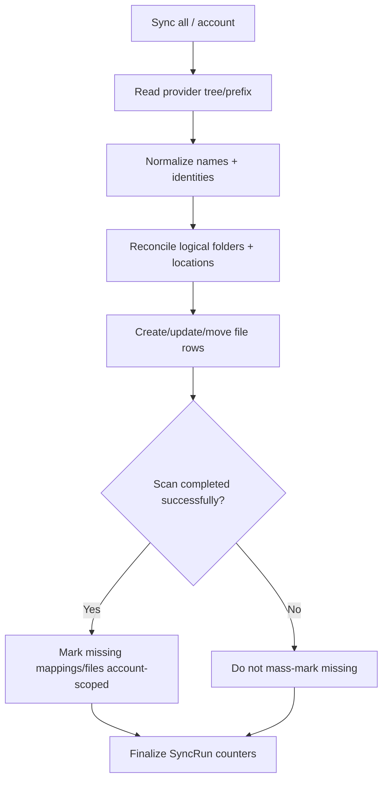

# Workflow: Provider → Virtual Sync

## Provider Rules

- Google Drive scanning uses bounded BFS/listing.
- S3 scanning is derived from object prefixes.
- Synchronization is a discovery/reconciliation process, not an upload/delete engine.

## Race Safety
Account synchronization has cancellation/single-run protection at the service layer. Sync-All concurrency is bounded by `SYNC_ACCOUNT_CONCURRENCY`; folder listing concurrency is bounded by `SYNC_FOLDER_LIST_CONCURRENCY`.
