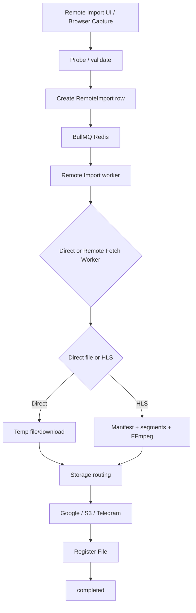

# Workflow: Remote Import

## Important Transitions

- Creation validates the selected worker first, then applies URL policy validation.
- Enqueue failure immediately marks the database row as failed.
- The worker sets `processing` and heartbeat only when execution starts.
- Cancel/retry operations coordinate persisted state with the queue job.
- Retry may resume from reusable stages/artifacts; a normal retry can fall back to downloading again.
- A reconciliation sweep detects queued-job mismatches and stale processing heartbeats.

## Secrets
Source URLs, request context, and resumable-upload secrets remain encrypted and must never appear in progress responses or logs.
