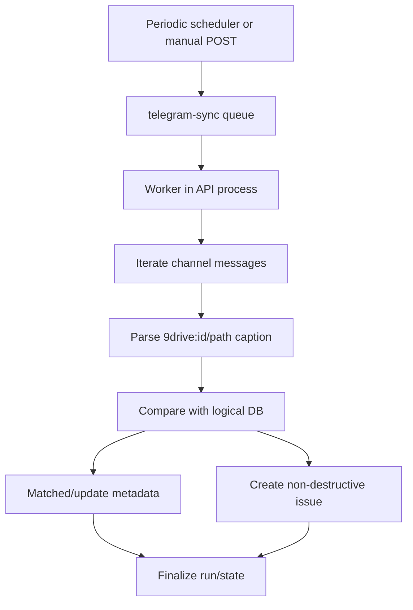

# Workflow: Telegram Reconciliation

## Initial/Incremental
`TelegramSyncState.lastMessageId` acts as the pagination/incremental cursor. The scheduler enqueues accounts when they are due based on the last scan time and configured interval.

## Conflict Handling
Orphan, missing, and metadata-mismatch conditions are recorded as `TelegramSyncIssue`. Resolution sets `resolvedAt`; do not physically delete issue history as the default behavior.

## Concurrency
`status='syncing'` acts as a single-flight guard. Rate-limit/FloodWait handling must remain bounded and retry-aware.
