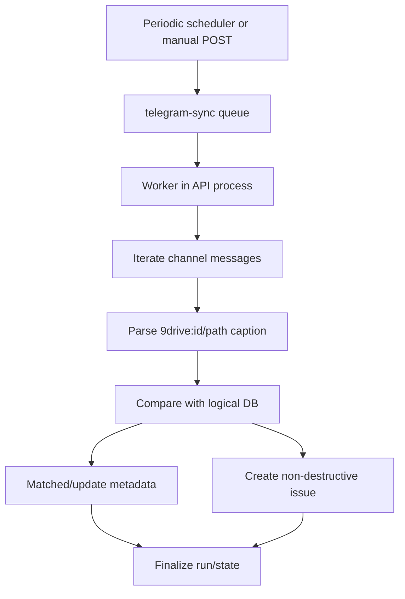

# Workflow: Telegram Reconciliation

When a caption contains encrypted metadata, sync normalizes raw, full-line,
and known double-prefixed values before comparison or decryption. A valid
legacy value continues through stable-id reconciliation; a payload that fails
authentication or format validation is recorded as
`TELEGRAM_METADATA_UNREADABLE` instead of being silently placed in the
recovery inbox.

## Initial/Incremental
`TelegramSyncState.lastMessageId` acts as the pagination/incremental cursor. The scheduler enqueues accounts when they are due based on the last scan time and configured interval.

## Conflict Handling
Orphan, missing, and metadata-mismatch conditions are recorded as `TelegramSyncIssue`. Resolution sets `resolvedAt`; do not physically delete issue history as the default behavior.

## Concurrency and Scaling
- `TELEGRAM_SYNC_CONCURRENCY` (default `2`) determines BullMQ worker slot count, letting different accounts scan concurrently.
- `status='syncing'` acts as the durable database single-flight guard. Simultaneous auto/manual queues for the same account deduplicate safely.
- Lock release is fully guaranteed on completion, error, cancellation, and worker exceptions. FloodWait waits remain account-local.
