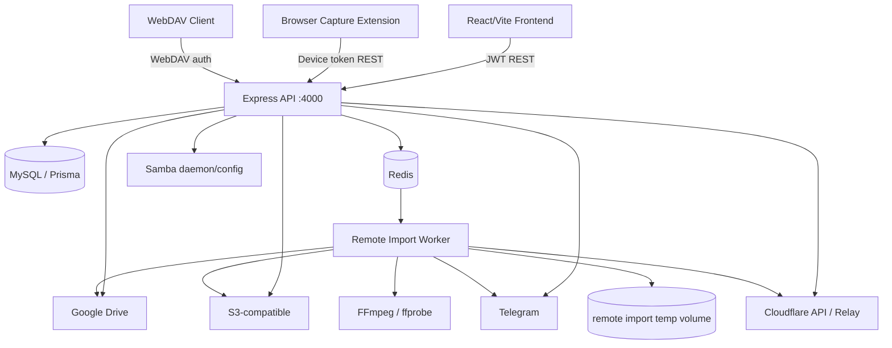

# Architecture Reference

## Components

## Main Processes

### Backend API
`backend/src/server.ts` → `app.ts`. Serves REST/WebDAV, starts the Telegram Sync worker and scheduler, and acts as the producer for the Remote Import queue.

### Remote Import Worker
Entry point: `backend/src/modules/remote-imports/worker-entry.ts`. This dedicated process/container consumes the queue, downloads/remuxes content, and uploads it to the destination storage provider.

### Frontend
React Router application defined in `frontend/src/App.tsx`, served by the Vite dev server or the production nginx image.

### Browser Extension
The manifest extension in `extensions/browser-capture/` captures media/resources and communicates with the Browser Capture API.

## Persistence

- MySQL: logical state, provider/account metadata, encrypted credentials, jobs, and audit data.
- Redis: queue/runtime coordination; it is not canonical business state.
- Remote Import temp volume: ephemeral/resumable staging.
- Storage providers: physical file bytes.
